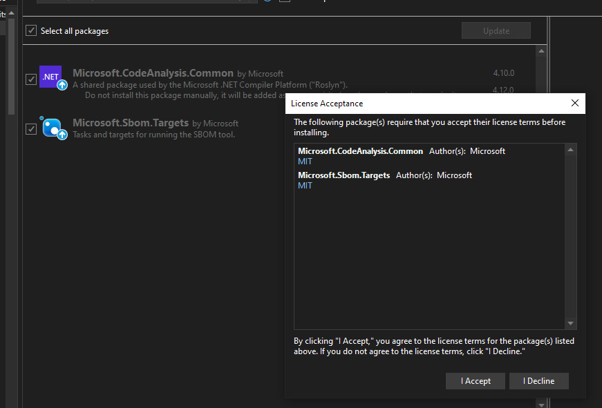

# Proj0217: Define requiring license acceptance explicitly
Various tools (such as Microsoft's Visual Studio) support prompts that require users
to explicitly accept licenses before NuGet packages can be installed. Enabling
this feature by setting `<PackageRequireLicenseAcceptance>` to `true`
ensures consumers of your package are given this prompt when trying to install
your package. However, if you don't explicitly define this, users will not be prompted
even if you would have liked them to.

The prompt from Visual Studio looks similar to:  


## Non-compliant
``` xml
<Project Sdk="Microsoft.NET.Sdk">

  <PropertyGroup>
    <TargetFramework>net8.0</TargetFramework>
    <IsPackable>true</IsPackable>
  </PropertyGroup>

</Project>
```

## Compliant
``` xml
<Project Sdk="Microsoft.NET.Sdk">

  <PropertyGroup>
    <TargetFramework>net8.0</TargetFramework>
    <IsPackable>true</IsPackable>
    <PackageRequireLicenseAcceptance>true</PackageRequireLicenseAcceptance>
  </PropertyGroup>

</Project>
```

Or:

``` xml
<Project Sdk="Microsoft.NET.Sdk">

  <PropertyGroup>
    <TargetFramework>net8.0</TargetFramework>
    <IsPackable>true</IsPackable>
    <PackageRequireLicenseAcceptance>false</PackageRequireLicenseAcceptance>
  </PropertyGroup>

</Project>
```

Or disable packability:

``` xml
<Project Sdk="Microsoft.NET.Sdk">

  <PropertyGroup>
    <TargetFramework>net8.0</TargetFramework>
    <IsPackable>false</IsPackable>
  </PropertyGroup>

</Project>
```
